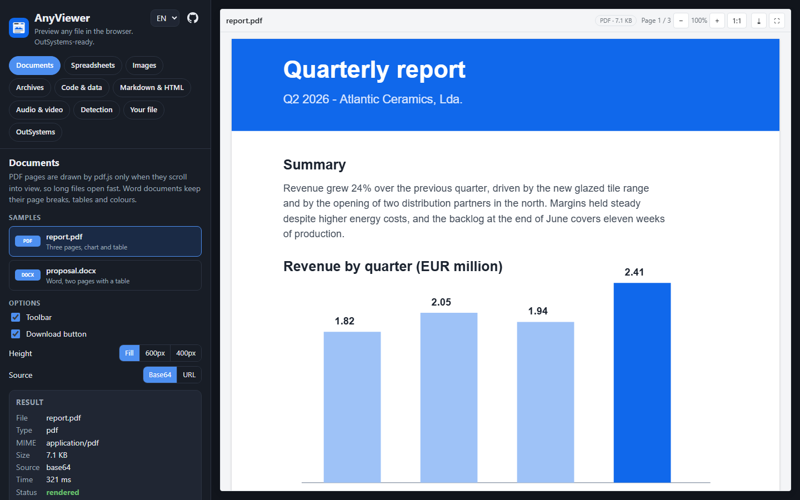
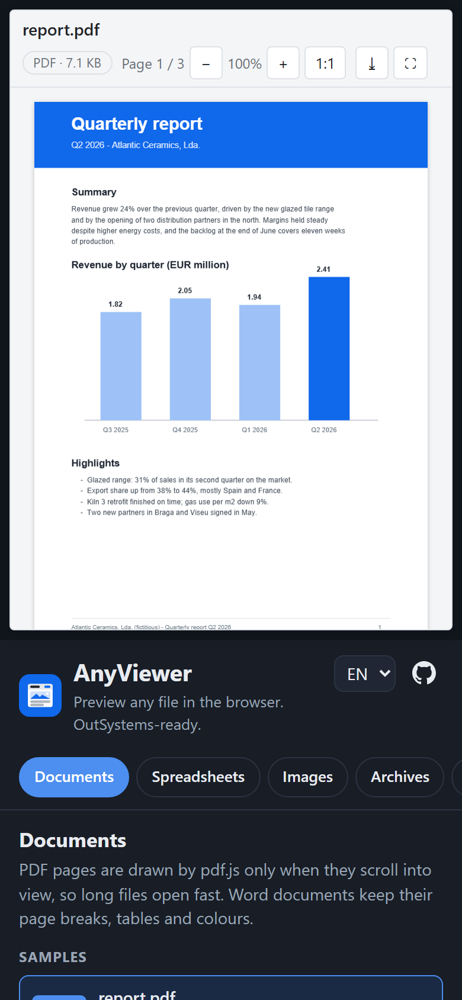
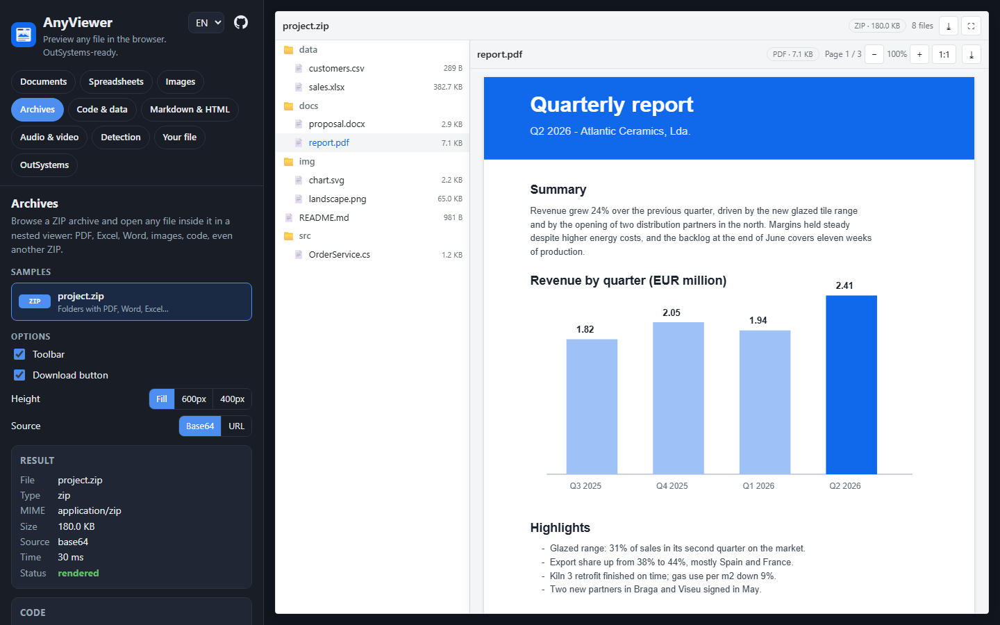
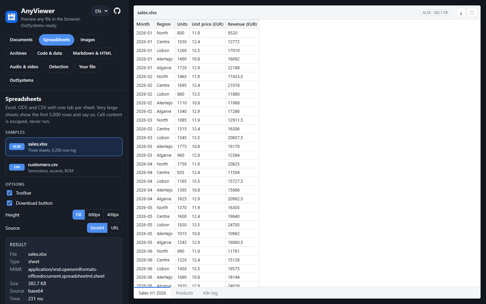

# AnyViewer

A **document previewer that runs in the browser**: images, PDF, Excel and CSV, Word, ZIP archives, text and code, Markdown, HTML, audio and video. One script, libraries loaded only when a file type needs them, a small options-in / events-out API, and ready to use as an **OutSystems** block.

**Live demo: <https://anyviewer.hfps.dev>.** It has seventeen sample files, English and Portuguese, an event log, and you can drop your own file on it. `npm run serve` runs it locally at <http://localhost:8765/demo/>.

<p align="center">
  
  
</p>

## Why

Business apps keep files: invoices, contracts, photos, spreadsheets, exports. Showing them usually means a download, or a commercial viewer that charges per document. Browsers can already render almost every common format with free libraries, but wiring pdf.js, SheetJS, docx-preview and friends into a low-code app, safely and without loading megabytes on every page, is real work. AnyViewer packages that into one call.

## Features

| Type | What you get |
|---|---|
| **PDF** | pdf.js, pages drawn only when they scroll into view, zoom, page counter; the worker runs from a blob URL, or on the main thread when workers are blocked |
| **Spreadsheets** | Excel (xlsx, xlsm, xlsb, xls), ODS, CSV and TSV with one tab per sheet; huge sheets show their first 5,000 rows and say so |
| **Word** | DOCX with page breaks, tables, colours, headers and footers |
| **Images** | PNG, JPEG, GIF, WebP, AVIF, BMP, ICO and SVG, with zoom and a transparency checkerboard |
| **Archives** | ZIP file tree; open any entry in a nested viewer, archives inside archives included |
| **Code and data** | Syntax highlighting for 36 languages, pretty-printed JSON, XML, logs and text, with a wrap toggle |
| **Markdown and HTML** | Markdown rendered and sanitised; HTML in a sandboxed frame, with a source view for both |
| **Audio and video** | The browser's own player, from bytes in memory |
| **Detection** | Extension, MIME type and the file's first bytes: a file with no extension still opens, and one the browser can't show gets a clear message and a download button |
| **Safe by default** | Nothing inside a file ever runs: sandboxed HTML, DOMPurify for Markdown, SVG as an image, escaped cells and text |
| **Light** | Only the 42 KB core loads with the page; each library runs the first time its file type is shown |
| **Themeable** | Follows OutSystems UI colour tokens when present, with neutral fallbacks |

<p align="center">
  
  
</p>

## Quick start

```html
<script src="dist/anyviewer.js"></script>

<div id="viewer"></div>
<script>
  AnyViewer.render('viewer', {
    url: 'files/report.pdf',          // or base64: '…', or bytes: Uint8Array
    fileName: 'report.pdf',
    height: '80vh',
    scriptsBaseUrl: 'dist/',          // where pdfjs.js, xlsx.js, … are
    onRendered: type => console.log('shown as', type),
    onError: message => console.error(message)
  });

  // when the viewer goes away
  AnyViewer.destroy('viewer');
</script>
```

Keep the scripts of [`dist/`](dist) together: the core fetches the others from `scriptsBaseUrl` the first time it needs them.

## Documentation

- [API reference](docs/API.md): options, methods, detected types, limits, styling, libraries and security
- [Using it in OutSystems](docs/outsystems.md): the block, its scripts and why they are wrapped, using it in an app, updating the scripts
- [Demo source](demo/app.js): every sample goes through `AnyViewer.render`

## OutSystems

AnyViewer is the engine of the **AnyViewer** Reactive library: one block with `FileContent` (Binary Data) or `FileUrl`, plus `FileName`, `Height`, `ShowToolbar` and `AllowDownload`, and two events, `OnRendered(DetectedType)` and `OnError(ErrorMessage)`. The nine files of `dist/` are its Required Scripts. They are wrapped so that loading them only registers a function: nothing heavy runs at page load, and the platform's AMD loader and RequireJS never see the libraries. See [docs/outsystems.md](docs/outsystems.md).

## Development

```bash
npm install
npm run build     # dist/ from src/anyviewer.js and the libraries installed by npm
npm run samples   # regenerates the demo's sample files in demo/samples/
npm test          # unit tests of type detection
npm run e2e       # headless Chrome: every sample, base64 and URL, ZIP entries, OutSystems mode
npm run serve     # http://localhost:8765/demo/
```

The end-to-end test and the sample generator use your installed Chrome through `puppeteer-core`; set `CHROME_PATH` if it is not in the default Windows location. `npm run e2e -- --shots` also refreshes the screenshots in `docs/img/`.

Layout: `src/` (the core), `dist/` (what ships, made by `scripts/build.mjs`), `demo/` (the showcase and its samples), `tests/`, `assets/` (icon and OutSystems block preview), `docs/`.

`npm run deploy` publishes the demo as a Cloudflare Worker with static assets (see [`wrangler.jsonc`](wrangler.jsonc)), live at <https://anyviewer.hfps.dev>.

## Sample files

Every sample in [`demo/samples/`](demo/samples) is generated by [`scripts/gen-samples.cjs`](scripts/gen-samples.cjs) and is fictitious: the company, the people and the figures.

## Credits

Created by **[Henrique Silva](https://github.com/henriquefps)**, Solutions Specialist at **Axians Low Code**.

Built on [pdf.js](https://mozilla.github.io/pdf.js/) (Apache-2.0), [SheetJS Community Edition](https://sheetjs.com) (Apache-2.0), [docx-preview](https://github.com/VolodymyrBaydalka/docxjs) (Apache-2.0), [JSZip](https://stuk.github.io/jszip/) (MIT), [highlight.js](https://highlightjs.org) (BSD-3-Clause), [marked](https://marked.js.org) (MIT) and [DOMPurify](https://github.com/cure53/DOMPurify) (Apache-2.0 / MPL-2.0).

## License

[MIT](LICENSE) © Axians
